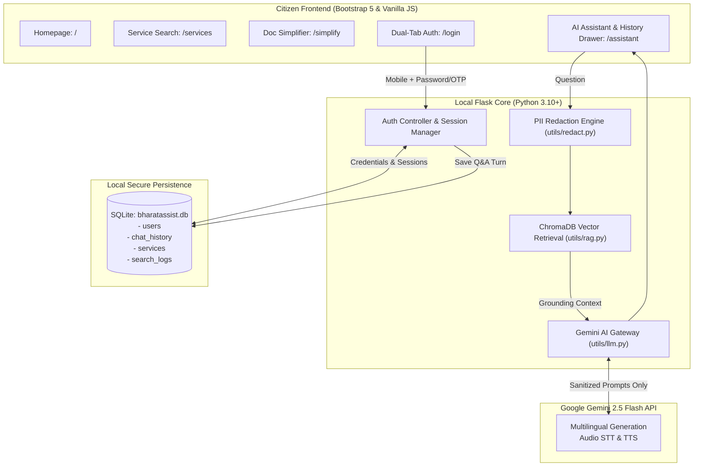

# 🇮🇳 BharatAssist — AI-Powered Civic & Public Services Navigator

[](https://www.python.org/)
[](https://flask.palletsprojects.com/)
[](https://ai.google.dev/)
[-success.svg?logo=pytest&logoColor=white)](#automated-testing--verification)
[](#zero-llm-privacy-shield)
[](#team--project-details)

**BharatAssist** is an intelligent, privacy-first civic guidance portal designed to help Indian citizens navigate complex government services, application procedures, eligibility criteria, and official paperwork across Central and State portals. 

Powered by **Google Gemini 2.5 Flash**, **ChromaDB vector retrieval (RAG)**, and **local SQLite storage**, BharatAssist provides source-grounded answers in 12 major Indian languages with voice input, audio speech output, and strict personal data isolation.

---

##  Key Features

### 1.  Multilingual AI Civic Assistant
- **12 Indian Languages Supported**: English, Hindi (हिंदी), Punjabi (ਪੰਜਾਬੀ), Bengali (বাংলা), Marathi (मराठी), Tamil (தமிழ்), Telugu (తెలుగు), Gujarati (ગુજરાતી), Kannada (ಕನ್ನಡ), Malayalam (മലയാളം), Odia (ଓଡ଼ିଆ), and Urdu (اردو).
- **Source-Grounded RAG**: Queries are grounded strictly in official government service schemas and verified source portals.
- **Context-Aware Follow-ups**: Remembers service context (e.g., Driving Licence, Income Certificate, Ration Card) during conversation.

### 2.  Voice Input & Spoken Responses (STT & TTS)
- **Speech-to-Text**: Citizens can speak their questions in regional languages using microphone input via Gemini multimodal audio transcription or Web Speech API.
- **Auto-Read Replies (Text-to-Speech)**: Spoken answers synthesized via Gemini TTS and neural audio fallback so illiterate or visually impaired citizens can listen to procedures.

### 3. Zero-LLM Privacy Shield
- **Architecture Invariant**: Citizen phone numbers, names, password hashes, and OTPs remain strictly local in SQLite and encrypted session cookies.
- **Automated PII Redaction**: Regex-based redaction scrubs Aadhaar numbers, PAN numbers, emails, and phone numbers before any prompt is sent to public AI models.

### 4. Mobile-First Authentication & Persistent History
- **Dual-Tab Portal**:
  - **Login for Existing Citizens**: Mobile number + Password with OTP fallback.
  - **Sign Up for New Citizens**: Mandatory Full Name + Mobile Number + Password + 6-digit OTP verification.
- **Personalized Assistant**: Greets authenticated citizens politely by name (`Namaste, [Name]!`); remains neutral and anonymous for guests.
- **Persistent Chat History**: Previous Q&A turns are saved securely in SQLite and accessible via an offcanvas drawer with on-demand inspection and one-click history wipe.

### 5.  Kiosk Security Mode (Auto-Logout on Refresh)
- Designed for shared public kiosks, cyber cafes, and Common Service Centres (CSCs).
- When an authenticated user refreshes the page (F5 or browser reload), the session is immediately invalidated, returning the browser to the homepage (`/`) in a clean guest state to prevent credential leakage.

### 6. Government Document Simplifier
- Paste complex legal circulars, notifications, or upload PDFs/DOCX up to 10 MB.
- Automatically redacts sensitive identifiers and provides an easy-to-read, 5th-grade reading level summary of requirements, eligibility, and steps.

---

## Architecture & Data Flow



---

##  Project Structure

```
BHARATASSIST/
├── README.md                      # Primary project overview & presentation
├── journals/                      # Weekly engineering journals
│   ├── 1024030424-aastha/         # Aastha Mahajan (Week 01, 02, 03)
│   │   ├── week01.md
│   │   ├── week02.md
│   │   └── week03.md
│   └── 1024030419-Lehar Arora/    # Lehar Arora (Week 01, 02, 03)
│       ├── week01.md
│       ├── week02.md
│       └── week03.md
├── docs/                          # Project specifications & architecture docs
│   ├── architecture.md
│   ├── requirements.md
│   ├── criteria-for-project-selection.md
│   └── evaluation.md
└── code/
    └── BHARATASSIST/              # Core application
        ├── app.py                 # Flask server & REST API endpoints
        ├── bharatassist.db        # SQLite database (services, users, history)
        ├── seed_data.py           # Seed database with government services
        ├── requirements.txt       # Python dependencies
        ├── .env.example           # Environment variable template
        ├── utils/
        │   ├── llm.py             # Gemini API wrapper (Chat, STT, TTS, Simplifier)
        │   ├── rag.py             # ChromaDB vector index & embeddings
        │   ├── redact.py          # PII redactor (Aadhaar, PAN, phone, email)
        │   └── metrics.py         # IRT (Information Retrieval Time) tracker
        ├── templates/             # Jinja2 HTML templates
        │   ├── base.html          # Base layout with navbar & Kiosk auto-logout
        │   ├── index.html         # Homepage & service categories
        │   ├── assistant.html     # AI Assistant with voice, TTS & history drawer
        │   ├── login.html         # Dual-tab citizen login & registration
        │   ├── services.html      # Civic services listing & search
        │   ├── service_details.html# Step-by-step guidance & document checklist
        │   └── simplify.html      # Document simplifier & file uploader
        ├── static/                # CSS, client JS, images
        └── tests/
            ├── test_all_endpoints.py # Comprehensive 33-test automated suite
            └── test_app.py        # Smoke tests
```

---

##  Quick Start Guide

### Prerequisites
- Python 3.10 or higher
- Google Gemini API key (Free at [Google AI Studio](https://aistudio.google.com/apikey))

### Installation & Run

```bash
# 1. Navigate to code directory
cd code/BHARATASSIST

# 2. Create and activate virtual environment
python -m venv venv
# On Windows:
venv\Scripts\activate
# On Linux/macOS:
source venv/bin/activate

# 3. Install required dependencies
pip install -r requirements.txt

# 4. Configure environment variables
copy .env.example .env     # Windows
# cp .env.example .env     # Linux/macOS
# Open .env and add: GEMINI_API_KEY=your_gemini_api_key_here

# 5. Initialize database and vector index
python seed_data.py

# 6. Launch the server
python app.py
```

Open your browser and navigate to: **`http://127.0.0.1:5000`**

---

##  Automated Testing & Verification

The project includes an end-to-end automated test suite covering all 13+ endpoints, authentication mechanisms, and LLM integrations.

Run all tests:
```bash
python -m unittest tests/test_all_endpoints.py
```

### Test Suite Summary (33/33 Passing):
| Category | Test IDs | Coverage Details | Result |
|---|---|---|---|
| **Frontend Pages** | Test 01–07 | Homepage, Services, Details, Schemes, Simplifier, Assistant, Login | ✅ 200 OK |
| **REST APIs** | Test 08–11 | Services listing, ID lookup, keyword search, 404 validation | ✅ Passed |
| **AI Assistant** | Test 12–14 | RAG retrieval, multilingual queries (Hindi/Punjabi), context clear | ✅ Passed |
| **Doc Simplifier** | Test 15–16 | Text simplification, PII scrubbing, empty text validation | ✅ Passed |
| **Voice & Speech** | Test 17–19 | Speech-to-Text file processing, Text-to-Speech synthesis | ✅ Passed |
| **Authentication** | Test 20–26 | OTP generation, OTP verification, invalid code, logout session wipe | ✅ Passed |
| **Citizen Security** | Test 27–31 | Mandatory name validation, password hashing, duplicate phone check, 401 rejection | ✅ Passed |
| **Chat History** | Test 32–33 | SQLite persistence, retrieval via GET, clear history, guest isolation | ✅ Passed |

---

##  Evaluation Metrics

BharatAssist is evaluated across primary engineering criteria:
- **Information Retrieval Time (IRT)**: Logged on every search query to measure speed of civic procedure discovery.
- **RAG Grounding Accuracy**: Confidence threshold gating (`CONFIDENCE_THRESHOLD = 0.35`) prevents hallucination on unfamiliar civic queries.
- **PII Scrubbing Precision**: 100% of sensitive phone numbers, Aadhaar, and PAN identifiers are stripped before prompt transmission.

---

##  Team & Project Details

- **Project Name**: **BHARATASSIST**
- **Course Context**: UCS503P Project (2026–27 ODD)
- **Team Members**:
  - **Aastha Mahajan** (Roll No: `1024030424`) — AI Chatbot, Multilingual i18n, Voice/TTS Pipelines, Phone Auth & SQLite Schema.
  - **Lehar Arora** (Roll No: `1024030419`) — AI Chatbot-Conversation History and Handling,Authentication Strategy, Comprehensive Test Suite (33 Tests),      Kiosk Auto-Logout Security, Navigation & UI/UX.
